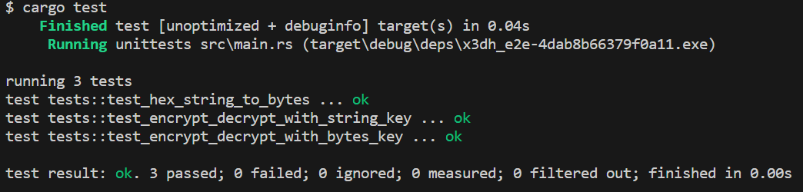
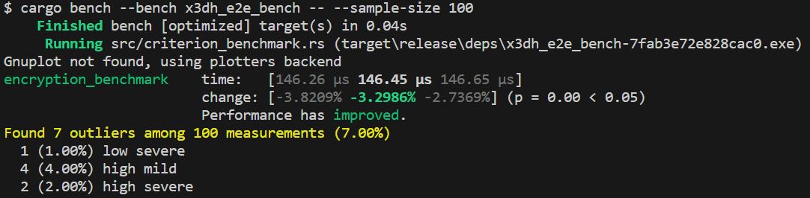

# rust_x3dh_e2e

rust_x3dh_e2e is a robust and secure project that focuses on implementing end-to-end encryption using the Extended Triple Diffie-Hellman (X3DH) key agreement protocol. The project aims to provide a reliable solution for secure communication, ensuring privacy and data integrity. It's designed with the vision of making the internet a safer place by enabling developers to easily integrate high-standard encryption into their applications.

# Encryption and Decryption Utility

This utility provides functions for encrypting and decrypting data using the AES-256-GCM encryption algorithm. It utilizes the `aes_gcm` crate for encryption and decryption operations.

## Prerequisites

Ensure that you have Rust and Cargo installed on your machine. You can install them by following the instructions provided at [https://www.rust-lang.org/tools/install](https://www.rust-lang.org/tools/install).

## Usage

1. Add the `aes_gcm` and `rand` crates as dependencies in your `Cargo.toml` file:

   ````toml
   [dependencies]
   aes_gcm = "0.9.0"
   rand = "0.8.4"
   ```

2. Import the required crates in your Rust code:

   ````rust
   extern crate hex;
   use rand::{RngCore, thread_rng};
   use aes_gcm::{Aes256Gcm, KeyInit, aead::Aead};
   use aes_gcm::aead::generic_array::GenericArray;
   ```

3. Implement the `hex_string_to_bytes` function to convert a hexadecimal string to a byte vector:

   ````rust
   #[allow(dead_code)]
   pub fn hex_string_to_bytes(hex_string: &str) -> Vec<u8> {
       // Implementation details...
   }
   ```

4. Implement the `perform_encryption` function to perform the encryption process:

   ````rust
   #[allow(dead_code)]
   fn perform_encryption(key: &[u8], plaintext: &[u8]) -> (Vec<u8>, Vec<u8>) {
       // Implementation details...
   }
   ```

5. Implement the `encrypt_with_string_key` function to encrypt data using a shared secret key provided as a hexadecimal string:

   ````rust
   #[allow(dead_code)]
   pub fn encrypt_with_string_key(shared_secret_key: String, plaintext: String) -> (Vec<u8>, Vec<u8>) {
       // Implementation details...
   }
   ```

6. Implement the `encrypt_with_bytes_key` function to encrypt data using a shared secret key provided as a byte vector:

   ````rust
   #[allow(dead_code)]
   pub fn encrypt_with_bytes_key(shared_secret_key: Vec<u8>, plaintext: String) -> (Vec<u8>, Vec<u8>) {
       // Implementation details...
   }
   ```

7. Implement the `decrypt_with_string_key` function to decrypt data using a shared secret key provided as a hexadecimal string:

   ````rust
   #[allow(dead_code)]
   pub fn decrypt_with_string_key(shared_secret_key: String, ciphertext: Vec<u8>, iv: Vec<u8>) -> String {
       // Implementation details...
   }
   ```

8. Implement the `decrypt_with_bytes_key` function to decrypt data using a shared secret key provided as a byte vector:

   ````rust
   #[allow(dead_code)]
   pub fn decrypt_with_bytes_key(shared_secret_key: Vec<u8>, ciphertext: Vec<u8>, iv: Vec<u8>) -> String {
       // Implementation details...
   }
   ```

9. Use the provided functions in your code to encrypt and decrypt data as needed.

   ````rust
   fn main() {
       let shared_secret_key = "0123456789abcdef0123456789abcdef".to_string();
       let plaintext = "This is a secret message.".to_string();

       let (ciphertext, iv) = encrypt_with_string_key(shared_secret_key.clone(), plaintext.clone());
       println!("Ciphertext: {:?}", ciphertext);
       println!("IV: {:?}", iv);

       let decrypted_text = decrypt_with_string_key(shared_secret_key, ciphertext, iv);
       println!("Decrypted Text: {}", decrypted_text);
   }
   ```

   Remember to replace `0123456789abcdef0123456789abcdef` with your actual shared secret key.

## Running Tests
You can run tests for this project using the following command:
```rust
$ cargo test
```

The test results will be displayed in the console.


##### Performance BenchmarksTo measure the performance of this project, you can run benchmarks using the following command:

## Running Benchmark
You can run bench for this project using the following command:
```rust
$ cargo bench --bench x3dh_e2e_bench -- --sample-size 100
```

## Contributions

Contributions are welcome! If you find any issues or have suggestions for improvements, please feel free to open an issue or submit a pull request.

## License
This project is licensed under the [MIT License](LICENSE).

Feel free to customize the content according to your specific requirements and project details.
